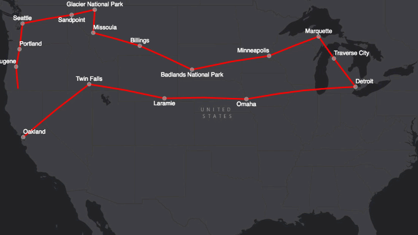

# Map Tour

This library takes a feature service of stops and animates great circle lines between them using the ArcGIS JavaScript API in either a 2D `MapView` or a 3D `SceneView`.

See a live version [here](https://nixta.github.io/tourmap/).

All it requires is a feature service with integer `Sequence` and string `Name` fields where records are to be visited in ascending `Sequence` order.



## Usage
Include the library by modifying `dojoConfig` before including the JS API (set the package `location` appropriately):

``` JavaScript
<script type="text/javascript">
  var package_path = window.location.pathname.substring(0, window.location.pathname.lastIndexOf('/'));
  var dojoConfig = {
    //The location.pathname.replace() logic below may look confusing but all its doing is
    // enabling us to load the api from a CDN and load local modules from the correct location.
    packages: [{
        name: "map-tour",
        location: package_path + '/src/js'
    }]
  };
</script>
```

Then create a tour instance, passing the `MapView` or `SceneView` to use for display. The instance will read properties from the URL's QueryString, loading features and parsing out arcs to animate through. The following code loads the default demo data and automatically starts the tour animation:

``` JavaScript
require([
  "esri/Map",
  "esri/views/MapView",
  "esri/layers/TileLayer",
  "map-tour/tour",
  "dojo/domReady!"
], function(Map, MapView, TileLayer, MapTour) {

  // Create the map.
  var map = new Map({
    basemap: {
      baseLayers: [new TileLayer({
        url: "https://services.arcgisonline.com/arcgis/rest/services/Canvas/World_Dark_Gray_Base/MapServer"
      })]
    }
  });

  // And the view.
  var view = new MapView({
    container: "viewDiv",
    map: map,
    center: [-100.68, 45.52], // lon, lat
    zoom: 4
  });

  // Start a tour
  var tour = new MapTour(view, true);
});
```

The following samples are included:

* 2D Sample with UI control (the UI is hidden while the animation progresses) [here](https://nixta.github.io/tourmap/) ([great circle version](https://nixta.github.io/tourmap/?forceGreatCircleArcs=true)).
* 3D Sample with UI control [here](https://nixta.github.io/tourmap/index3d.html) ([great circle version](https://nixta.github.io/tourmap/index3d.html?forceGreatCircleArcs=true)).
* Minimal 2D sample with property watching [here](https://nixta.github.io/tourmap/simple.html) ([great circle version](https://nixta.github.io/tourmap/simple.html?forceGreatCircleArcs=true)).
* Minimal 2D auto-starting sample [here](https://nixta.github.io/tourmap/simple-autostart.html) ([great circle version](https://nixta.github.io/tourmap/simple-autostart.html?forceGreatCircleArcs=true)).


### Constructor
The constructor requires at least one parameter, the `MapView` or `SceneView` to animate the tour in. By default, the tour will load its data but will wait to be manually started

``` JavaScript
  var tour = new MapTour(view);
```

The second parameter is optional and can be `true` to force the animation to start immediately or an `integer` (in milliseconds) to start the animation after a delay.

``` JavaScript
  // Start as soon as the view has loaded.
  var tour = new MapTour(view, true);
```

or

``` JavaScript
  // Start 2 seconds after the view finishes loading.
  var tour = new MapTour(view, 2000);
```

### Animating the tour
By default, the tour will not start automatically (see the constructors above). Without passing a second parameter to force a start, you should wait until the tour is `ready` (that is, it has loaded all its data and is ready to start).

``` JavaScript
  var tour = new MapTour(view);

  tour.watch("ready", function () {
    view.goTo(tour.extent).then(function () {
      tour.animate();
    });
  });
```

### MapTour properties
A `MapTour` instance has the following [watchable](https://developers.arcgis.com/javascript/latest/guide/working-with-props/index.html) properties:

| Property | Description |
| -------- | ----------- |
| ready | `true` when enough data has been loaded to start the tour. Initially `false`. |
| extent | An `Extent` object describing the bounds of the tour. See [Extent](https://developers.arcgis.com/javascript/latest/api-reference/esri-geometry-Extent.html). |
| loadError | Will be `undefined` unless an error is encountered loading the tour data. |

### MapTour methods
A `MapTour` instance has the following methods:

| Method | Description |
| ------ | ----------- |
| `animate()` | Starts the tour animation and returns a [promise](https://developers.arcgis.com/javascript/latest/guide/working-with-promises/index.html) that is fulfilled when the animation ends. |
| `animateWithDelay()` | Same as `animate()` but the first parameter is a delay in milliseconds before the animation begins. |
| `clearDisplay()` | When you start an animation, any graphics from a previous display of the tour are cleared. This function is useful if you need to clear the display without starting a new animation. |

### URL Parameters

By default a `MapTour` instance will reference a demo dataset with a detailed real-world route. However, it will also scan the URL QueryString to override inidividual settings.

| Parameter           | Value |
| ------------------- | ----- |
| `stopServiceURL`    | The URL to a public feature service containing points to tour between. |
| `stopNameField`     | Override the field to use for reading the point's name to display on the map (default `Name`). |
| `stopSequenceField` | The field to use for reading the point's sequence in the tour (default `Sequence`). |

All parameters are optional. If no parameters are provided, a demo dataset is used (see the advanced `agolRouteResultURL` parameter).

### Advanced Usage

The following URL parameters are also accepted:

| Parameter           | Value |
| ------------------- | ----- |
| `forceGreatCircleArcs` | Any value (but be a decent human being and use `true`) will force Great Circle lines to be drawn between stops in the case where detailed polylines are provided (see `agolRouteResultURL`). If you just provide a `stopServiceURL` this parameter is ignored. |
| `agolRouteResultURL` | A URL to a service created from an ArcGIS Online Directions calculation. At the time of writing (July 9, 2016), a bug in ArcGIS Online's Web Map Viewer means only simple routes can be saved this way (a fix is coming). The demo tour (no parameters) is the equivalent of just providing this parameter with [this sample service](https://services.arcgis.com/OfH668nDRN7tbJh0/arcgis/rest/services/Oakland_to_Gloucester/FeatureServer"). |

If you are a masochist, you can also provide a full configuration object to the constructor as the second parameter. This must be a valid config object. You can use two `MapTour` class-level methods to obtain config objects for modification before passing to the constructor. This would be a good place to mention that pull requests are accepted:

| Class Method | Description |
| ------------ | ----------- |
| `defaultConfig()` | Return a default configuration object.|
| `getConfig()` | Return a default configuration object populated with any relevant URL parameters for the current page. |

